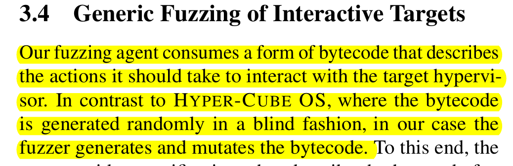

# Strengthening fuzzing of libraries with static analysis information

The idea is to use static analysis to analyse the source code of some libraries.

The static analysis should give information about API and global structures of the library.
Finally, we could mount a seed generation (and new mutation strategy) to speed up library fuzzing without using a software a proxy.

## Goals and contribution

In a first approximation, my goal would be to automatically generate the *bytecode* to interact with a library from static analysis.

Long story short, I want to generalize this problem (taken from Nyx -- Usenix Sec 2020):

Then, the actual fuzzying optimization can be left as problem a part.