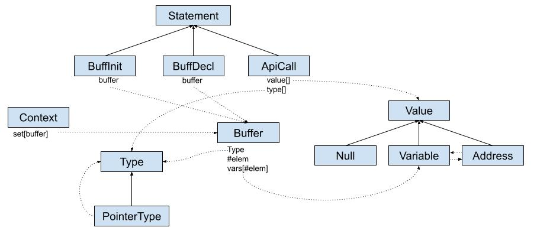

# Driver IR Language

This is a reprensentation of my Driver IR.

TLDR,

- I have only three statements: `BuffDecl`, `BuffInit`, and `ApiCall` (I am thinking to a cast statement, not sure yet).
- All the `Variable` are allocated into `Buffers`, this allows me to handle arrays and scalars transparently (i.e., a pionter to a `Variable` also points to an `Buffer`)
- This schema allows to define `Buffer` of `PointerType`, even though it is not fully implemented yet. Only 2 levels of reference are handled so far.



## `const` attribute

`const` attribute is a bad beast! At the moment, I follow this policy:

1.  `Type` contains also the attributes (like `const`) and the `hash()` function of Type consider `const`, i.e., `const int` != `int`
2. For arguments, I pretend `const` is not set (this allows me a better control over the input)
3. I consider `const` only for the return types

This example shows some examples. So far, this works quite well.

```
#include <stdio.h>
#include <string.h>

int XX = 10;

const int foo(const int x) {return x + x;}
const int* baz() {return &XX;}
int* baz2() {return &XX;}

int main(int argc, char** argv) {
    int c[2];
    const int* d[2];

    memcpy(c, argv, sizeof(c));
    // memcpy(d, argv, sizeof(d)); WRONG! I don't want to initlize const pointers...

    c[0] = foo(c[1]);
    d[0] = baz();
    d[1] = baz2();
    
    return 0;
}
```